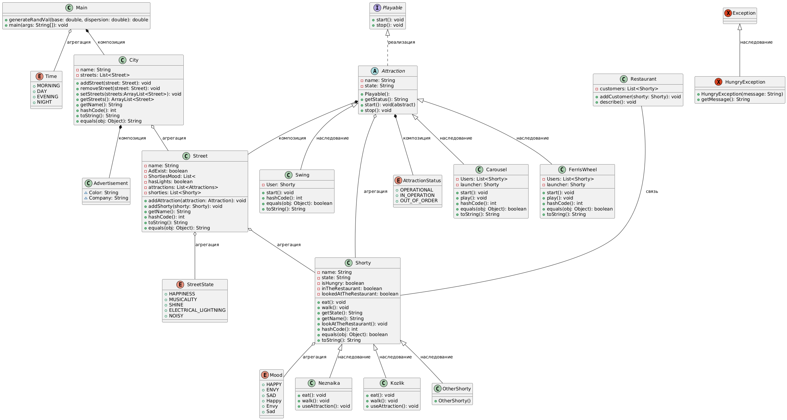

Скоро наступил вечер. Повсюду засветились яркие огни реклам. Центральные улицы города, куда забрели в это время Незнайка с Козликом, наполнились электрическим светом, весельем и музыкой, гуляющими и танцующими коротышками, скрипением качелей, вертящихся каруселей, чертовых колес и других приспособлений для веселого времяпрепровождения. В этом отношении Сан-Комарик ничем не отличался от других больших лунных городов. Незнайка и Козлик с завистью поглядывали на коротышек, которые сидели у ресторанов за столиками и угощались разными вкусными блюдами. Смотреть на все это и не иметь возможности утолить голод было очень мучительно.

Main - запускаем всю логику
Наступает вечер. Рекламы в городе. Идут Незнайка и Козлик, (если все коротышки веселые) улица наполнилась весельем (если генератор рандомных чисел выдаст > 0.6) музыкой. Если можно запустить аттракцион: рабочий, есть запускатель, то запускаем

1. Добавить логику рекламных баннеров
2. Добавить логику для запуска аттракционов
3. Если коротышки веселые, то улица наполняется весельем
4. Если коротышки смотрят на ресторан и не находятся в нем, то они голодны
5. Если коротышки не смотрят на ресторан, то они не голодны
6. Если коротышки смотрят на ресторан и находятся в нем, то они не голодны

